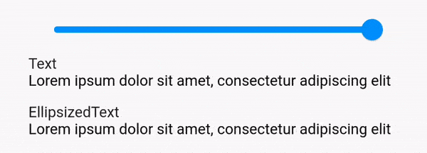
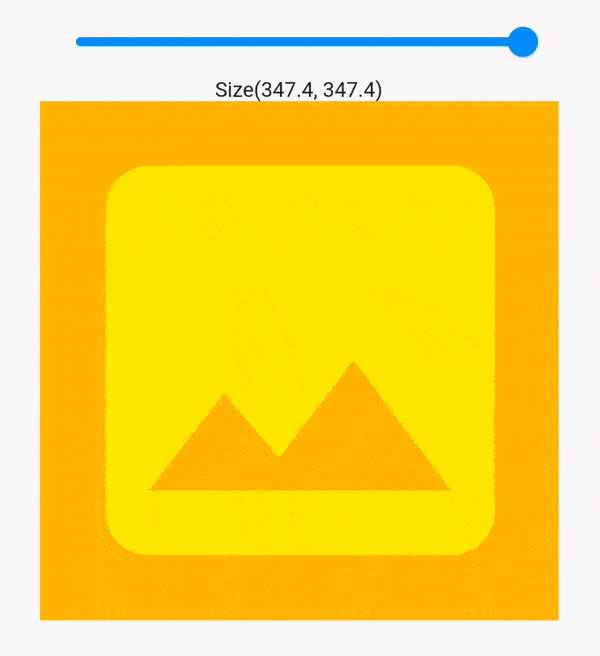
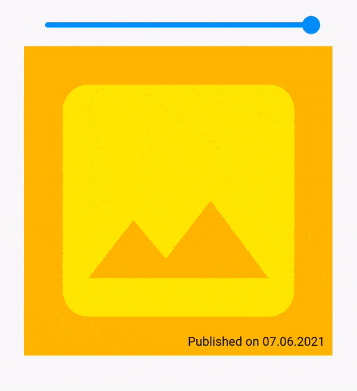

# Flutter - Custom Widgets

## Part 1 - EllipsizedText / LeafRenderObjectWidget

[Writing custom Widgets in Flutter (Part 1) — EllipsizedText](https://rlesovyi.medium.com/writing-custom-widgets-in-flutter-part-1-ellipsizedtext-a0efdc1368a8)

## Part 2 - ChildSize / SingleChildRenderObjectWidget

[Writing custom Widgets in Flutter (Part 2.a) — ChildSize (with helpers)](https://rlesovyi.medium.com/writing-custom-widgets-in-flutter-part-2-singlechildrenderobjectwidget-5637fecdf9bb)
[Writing custom Widgets in Flutter (Part 2.b) — ChildSize (no helpers)](https://rlesovyi.medium.com/writing-custom-widgets-in-flutter-part-2-b-childsize-no-helpers-61c578c9bbd2)

## Part 3 - SimpleOverlay / MultiChildRenderObjectWidget

[Writing custom Widgets in Flutter (Part 3.a) — SimpleOverlay (with helpers)](https://rlesovyi.medium.com/writing-custom-widgets-in-flutter-part-3a-simpleoverlay-with-helpers-6b3990db48b6)

